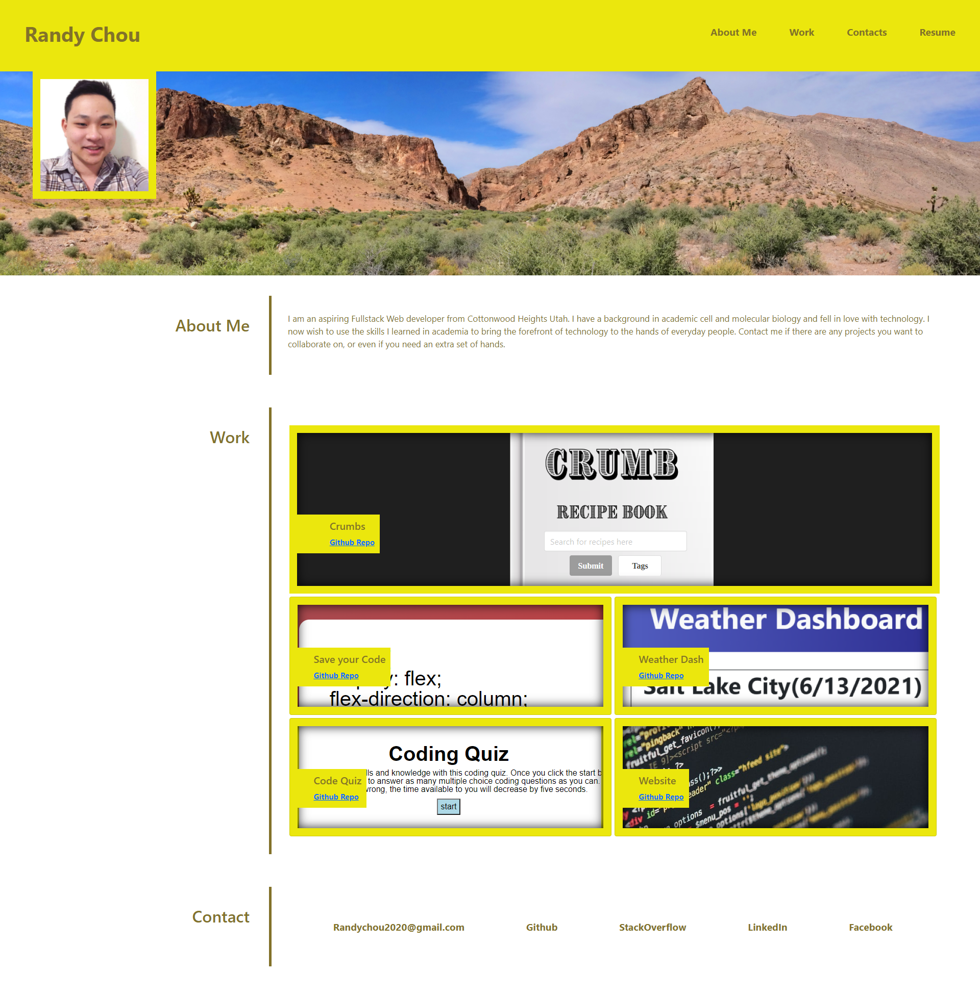
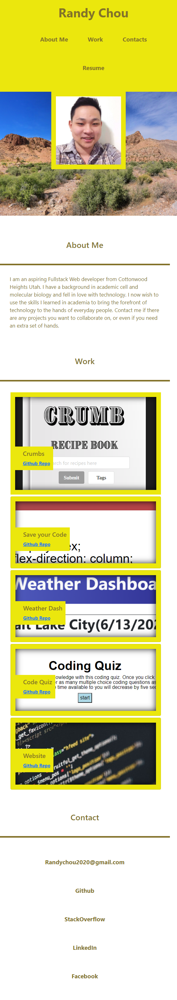

# professional-portfolio-2021
## Description
This is my first attempt at coding a professional portfolio to showcase my skills as a full-stack programmer as well as the various projects I have done. In the future I will be adding more projects and programming concepts to the page as I grow more as a coder. This project helped me practice wireframing and planning which greatly simplified the coding process. However, I also 
## Table of Contents (Optional)
- [Installation](#installation)
- [Usage](#usage)
- [Credits](#credits)
- [License](#license)
## Installation
No instillation necessary, 
## Usage
Deployed Link:https://randy-chou.github.io/professional-portfolio-2021/

Screenshots:

## Credits
VScode
## License
N/A
## Badges
N/A
## Features
Links at in the header scrolls the viewport to the corresponding section. Cards in the works section link to their corresponding deployed projects. Links in the contacts section lead to various media accounts.
## How to Contribute
N/A
## Tests
N/A
